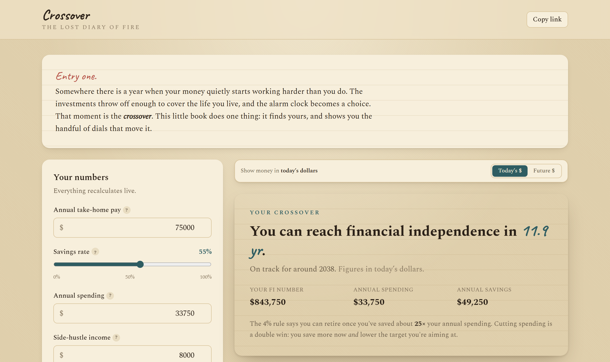

# Crossover

**The Lost Diary of FIRE.** A shockingly simple financial independence
calculator that shows when your savings rate sets you free — the one number that
matters more than your salary or your net worth.

🔗 **Live:** https://mphinance.github.io/crossover/



Crossover is a calculator and explainer, **not** financial advice. It runs
entirely in your browser — no backend, no accounts, nothing sent anywhere. The
whole thing is dressed as an aged diary: warm paper, fountain-pen ink, and
handwritten margin notes that react to what you type.

---

## The idea

Two well-worn ideas from the FIRE community, in one page:

1. **The crossover point** (from *Your Money or Your Life*) — the moment income
   from your investments rises to meet, then exceed, your living expenses.
2. **The shockingly simple math** (Mr. Money Mustache) — years-to-FI depends
   almost entirely on your **savings rate**, not on how much you earn. Someone
   earning \$40k and saving half reaches FI in the same time as someone earning
   \$400k and saving half.

Cutting spending is a double win: you save more *now* **and** lower the target
you're aiming at, which is why high savings rates collapse the timeline so fast.

## Features

- **Live headline** — "you can reach financial independence in X years," with a
  target year, recomputed as you type.
- **FIRE-style switcher** — the same engine re-pointed at five finish lines:
  Standard, Lean, Fat, Coast, and Barista FIRE, with a one-tap compare strip.
- **Side-hustle income** — extra annual income that gets invested on top of your
  savings and powers the Barista FIRE number.
- **The "one more year" trap** — what each extra working year past your crossover
  buys in sustainable spending and cushion, and the time you trade for it.
- **Today's / future dollars toggle** — restate every figure in inflated future
  dollars without touching the (always-real) underlying math.
- **Diary margin notes** — handwritten scrawls that react to your inputs. A 12%
  return gets "optimistic, friend"; a sub-5-year crossover gets "show-off."
- **The crossover chart** — annual expenses vs. investment income, with the
  crossover point annotated.
- **Net-worth growth chart** — your invested assets compounding toward the FI
  target (a flat line in real terms, a rising one in future dollars).
- **The MMM table** — years-to-FI for savings rates from 5% to 95%, with your
  row highlighted.
- **Two-way sync** — edit spending or savings rate; they stay consistent.
- **Scenario comparison** — save up to three named setups and compare side by
  side (kept in `localStorage`).
- **Shareable links** — the full scenario is encoded in the URL; "Copy link"
  reproduces it exactly.
- **A field guide to FIRE** — plain-language definitions of every variant, plus
  the big sequence-of-returns caveat.

## The math

The core figures are **real** (inflation-adjusted), so they're in today's
dollars; the future-dollar toggle is a pure display layer that re-inflates them
and never feeds back into the solve. With take-home pay `P`, savings rate `s`,
side-hustle income `H`, real return `r`, and withdrawal rate `w`:

```
annualSavings  = P * s + H
annualSpending = P * (1 - s)
fiTarget       = annualSpending / w          # 4% rule => 25× spending
```

The FIRE variants reuse this engine with a different finish line: Lean and Fat
scale the spending you must cover, Coast discounts the full target back to the
pile you'd need today to coast to retirement age, and Barista subtracts your
side income from the spending the portfolio has to fund.

Years to FI solves the future value of current net worth plus a growing annuity
of savings against `fiTarget`. Closed form when starting from zero net worth,
bisection otherwise, and a linear branch when `r = 0`. Edge cases (0% rate →
never, 100% → already there, already-funded, invalid input) are all handled.

The model lives in one pure, tested module — [`src/lib/fire.js`](src/lib/fire.js)
— and the headline, both charts, and the table all read from it, so they can
never drift out of sync.

### Reference anchors (5% real return, 4% withdrawal)

| Savings rate | ~Years to FI |
| ------------ | ------------ |
| 10%          | ~51          |
| 25%          | ~32          |
| 50%          | ~17          |
| 75%          | ~7           |

## Tech

React + Vite + Tailwind CSS + Recharts. No backend, no API calls. Deployable as
a static site (this repo auto-deploys to GitHub Pages on every push to `main`).

## Develop

```bash
npm install
npm run dev      # http://localhost:5173
npm test         # the fire.js math suite (Vitest)
npm run build    # static output in dist/
npm run preview  # serve the production build locally
```

## Deploy

A GitHub Actions workflow ([`.github/workflows/deploy.yml`](.github/workflows/deploy.yml))
runs `npm ci`, the test suite, and the build, then publishes `dist/` to GitHub
Pages. A failing test blocks the deploy.

## Disclaimer

Crossover produces illustrative projections based on assumptions you supply.
Real returns, inflation, taxes, and spending are uncertain. Nothing here is
personalized advice. Consult a licensed professional before making real
financial decisions.

---

Built with [Claude Code](https://claude.com/claude-code).
